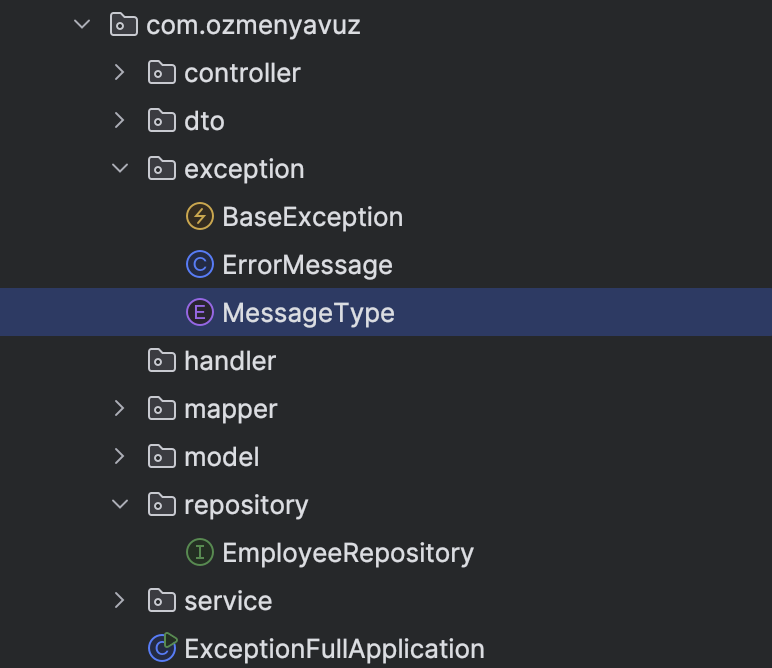

# ⚠️ Global Exception Handling in Spring Boot

Exception handling is a fundamental aspect of building **robust** and **user-friendly** applications, especially in
enterprise environments like those supported by Spring Boot.

Properly managing exceptions ensures that your application can gracefully handle unexpected issues during runtime,
improving both its **stability** and **usability**.

---

## 🧠 Why Exception Handling Matters

- Prevents the application from crashing due to unhandled errors
- Provides meaningful and structured error responses to the client
- Simplifies debugging and log tracking
- Enhances API reliability in production

---

## 📚 What You'll Learn

In this article (and this project), you’ll explore:

1. Why exception handling is critical in real-world applications
2. How to implement centralized exception handling in Spring Boot
3. The use of `@ControllerAdvice`, `@ExceptionHandler`, and custom error response objects
4. Practical code examples to build your own global error handling mechanism

---

## 🧪 Example Use Case

When a client makes a request to an invalid endpoint or provides incorrect input, instead of returning a raw stack trace
or a 500 Internal Server Error, the application responds with a **clear and structured JSON error message**, like this:

## 🧩 Understanding Exceptions in Spring Boot

<p align="center">
  
</p>

---

### 📌 Types of Exceptions

In Java and Spring Boot, exceptions are divided into **three main categories**:

#### 1. ✅ Checked Exceptions

- Checked at **compile-time**.
- Require explicit handling using `try-catch` blocks or by declaring with the `throws` keyword.
- Example: `IOException`, `SQLException`

#### 2. ⚠️ Unchecked Exceptions

- Checked at **runtime**, not during compilation.
- Usually caused by programming logic errors or misuse of APIs.
- Example: `NullPointerException`, `ArrayIndexOutOfBoundsException`

#### 3. ❌ Errors

- Serious problems **beyond the control** of the application.
- Typically indicate system-level issues.
- Example: `OutOfMemoryError`, `StackOverflowError`

---

### 🧠 Why Exception Handling is Important

Effective exception handling ensures the **continuous operation** of your application despite unexpected runtime
conditions.

Benefits include:

- Returning meaningful error messages to users or systems
- Assisting developers in debugging with detailed context
- Ensuring data consistency and proper application flow
- Avoiding system crashes and improving user experience

---

> "In robust systems, exceptions are handled — not feared."

## 🛠 Response Factory Methods (`ok()` and `error()`)

The following static methods are part of the `RootEntity<T>` class. They are used to standardize success and error
responses in your API by providing a consistent response structure for both successful and failed operations.

```]java
public static <T> RootEntity<T> ok(T data) {
    RootEntity<T> rootEntity = new RootEntity<>();
    rootEntity.setData(data);
    rootEntity.setResult(true);
    rootEntity.setErrorMessage(null);
    return rootEntity;
}

// Error Response

public static <T> RootEntity<T> error(String errorMessage) {
    RootEntity<T> rootEntity = new RootEntity<>();
    rootEntity.setData(null);
    rootEntity.setResult(false);
    rootEntity.setErrorMessage(errorMessage);
    return rootEntity;
}

<p align="center">
  
</p>
``` 

___ 

## 🔁 MapStruct Integration

### 🧠 What is MapStruct?

[MapStruct](https://mapstruct.org/) is a **Java annotation-based code generator** that simplifies the process of mapping
between different Java beans, such as **Entities** and **DTOs (Data Transfer Objects)**. Instead of manually writing
boilerplate conversion code, MapStruct automatically generates the mapping logic at **compile time**, ensuring
performance and type safety.

---

### ✅ Why Did We Use MapStruct?

We chose MapStruct in this project to:

- ✅ Eliminate manual and repetitive mapping logic
- ✅ Ensure **type-safe**, **compile-time** checked transformations
- ✅ Improve **code readability** and **maintainability**
- ✅ Cleanly separate internal entity models from exposed DTOs in API
- ✅ Avoid runtime cost of reflection-based tools like `BeanUtils.copyProperties`

---

### 🧩 Mapper Interface Definition

We created a `EmployeeMapper` interface that tells MapStruct how to convert between Entity and DTO classes.

```]java
@Mapper(componentModel = "spring")
public interface EmployeeMapper {

    DtoEmployee toDto(Employee employee);
    Employee toEntity(DtoEmployee dtoEmployee);

    DtoDepartment toDto(Department department);
    Department toEntity(DtoDepartment dtoDepartment);
} <p align="center">
  
</p>
``` 

## Exception Architecture


___ 

## ❗ Custom Exception Handling Structure

---

## ❗ Custom Exception Handling with BaseException, ErrorMessage, and MessageType

In this project, we implement a clean and structured **custom exception handling mechanism** that improves the clarity,
consistency, and maintainability of error responses. Instead of throwing raw or framework-specific exceptions, we define
our own centralized system using three core components:

---

### 🧩 1. `MessageType.java`

```]java
public enum MessageType {

    NO_RECORD_EXIST("1001", "RECORD NOT FOUND"),
    GENERAL_EXCEPTION("9999", "GENERAL ERROR OCCURRED");

    private final String code;
    private final String message;

    MessageType(String code, String message) {
        this.code = code;
        this.message = message;
    }

    public String getCode() {
        return code;
    }

    public String getMessage() {
        return message;
    }
}
<p align="center">
  
</p> 
```  

___

### 2⃣ `ErrorMessage.java`

```]java
@Data
@AllArgsConstructor
@NoArgsConstructor
public class ErrorMessage {

    private MessageType massageType;
    private String ofStatic;

    public String prepareErrorMessage(){
        StringBuilder builder = new StringBuilder();
        builder.append(massageType.getMessage());
        if (ofStatic != null) {
            builder.append(" : ").append(ofStatic);
        }
        return builder.toString();
    }
}
<p align="center">
  
</p> 
```  

### 🧩 3.  `BaseException.java`

```]java
pupublic class BaseException extends RuntimeException {

    public BaseException() {
    }

    public BaseException(ErrorMessage errorMessage) {
        super(errorMessage.prepareErrorMessage());
    }
}
<p align="center">
  
</p> 
```  

## 📚 Quellen (Kaynakça)

- https://www.udemy.com/course/sifirdan-ileri-seviye-spring-kursu/learn/lecture/46192207#overview

- https://medium.com/@ksaquib/exception-handling-in-spring-boot-a-comprehensive-guide-2491b43a841b